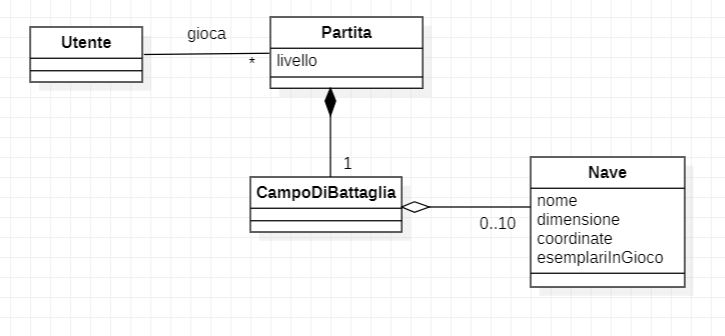

# Report
## Indice
1. Introduzione
2. Modello di dominio
3. Requisiti specifici
   1. Requisiti funzionali
     2. Requisiti non funzionali
4. System Design
5. OO Design
6. Riepilogo del test
7. Manuale utente
8. Processo di sviluppo e organizzazione del lavoro
9. Analisi retrospettiva
   1. Sprint 0  
 
 ---
# 1. Introduzione
 Il progetto riguarda la realizzazione di un noto gioco di strategia: la battaglia navale, il cui obbiettivo è quello di affondare, nel numero di tentativi disponibili, le varie tipologie di navi esistenti sul campo generato automaticamente dal computer.
 
 L'utente ha a disposizione diversi comandi, i quali possono essere visualizzati tramite il comando `/help`, essi permettono di:
 
- Impostare la difficoltà di gioco ( facile, medio, difficile )
- Mostrare il livello di gioco e il numero massimo di tentativi disponibili
- Mostrare le differenti navi e il numero di esemplari da affondare
- Avviare una nuova partita
- Svelare la griglia con le navi posizionate
- Uscire dal gioco previa conferma

---

 
 

# 2. Modello di dominio

# 3. Requisiti specifici
## 3.1 Requisiti specifici
Requisito funzionale 1 : *Visualizzazione Help*

Come giocatore voglio mostrare l'help con elenco comandi, digitando il comando:
> `/help` o invocando l'app con flag `--h` o `-h`

Il programma risponde con: 

Una descrizione concisa, che normalmente appare all'avvio del programma seguita dalla lista dei comandi dispomibili, uno per riga, come da esempio:
 
- Gioca

- Esci

- ...
#
Requisito funzionale 2 : *Chiusura gioco*

Come giocatore voglio chiudere il gioco, digitando il comando:

>`/esci`

L'app chiede conferma:

- Se la conferma è positiva, l'applicazione si chiude restituendo il controllo al sistema operativo
- Se la conferma è negativa, l'applicazione si predispone a ricevere nuovi tentativi o comandi
#
Requisito funzionale 3: *Livello di gioco*

Come giocatore voglio impostare il livello di gioco per variare il numero massimo di tentativi sbagliati, digitando i comandi:

>`/facile` 
- L'app risponde con OK e imposta a 50 il numero massimo di tentativi falliti

>`/medio`

- L'app risponde con OK e imposta a 30 il numero massimo di tentativi falliti

>`/difficile` 

- L'app risponde con OK e imposta a 10 il mumero massimo di tentativi falliti
#
Requisito funzionale 4 : *Visualizzazione livello di gioco e numero tentativi*

Come giocatore voglio mostrare il livello di gioco e il numero massimo di tentativi falliti, digitando il comadndo :

>`/mostralivello`

L'app risponde visualizzando il livello di gioco e il numero massimo di tentativi falliti
#
Requisito funzionale 5 : *Visualizzazione navi e numero relativo*

Come giocatore voglio mostrare i tipi di nave e il numero, digitando il comando :

>`/mostranavi`

L'app risponde visualizzando, per ogni tipo di nave, la dimensione in quadrati e il numero di esemplari da affondare:

- Cacciatorpediniere &emsp;&ensp;⊠⊠&emsp; *Esemplari : 4*

- Incrociatore &emsp; &emsp; &emsp;⊠⊠⊠&emsp; *Esemplari : 3*

- Corazzata &emsp;&emsp; &emsp; ⊠⊠⊠⊠&emsp; *Esemplari : 2*       

- Portarei &emsp;&emsp; &emsp; ⊠⊠⊠⊠⊠&emsp; *Esemplari : 1*
#
Requisito funzionale 6 : *Iniziare una nuova partita*

Come giocatore voglio iniziare una nuova partita, digitando il comando : 

>`/gioca`

Se nessuna partita è in corso l'applicazione imposta casualmente le navi, in orizzontale o in verticale, mostra la griglia vuota e si predispone a ricevere il primo tentativo o altri comandi.
#
Requisito funzionale 7 : *Svelare griglia con navi in gioco*

Come giocatore voglio svelare la griglia con le navi posizionate, digitando il comando :

>`/svelagriglia`

L'applicazione risponde visualizzando, una griglia 10x10, con le righe numerate da 1 a 10 e le colonne numerate da A a J, e tutte le navi posizionate

---

 
 

## 3.2 Requisiti non funzionali 
---

 

Requisito non funzionale 1 :

Il container docker dell’app deve essere eseguito da terminali che supportano Unicode con encoding UTF-8 o UTF-16.
Elenco di terminali supportati:

Linux:

- terminal
	
Windows:

- Powershell

- Git Bash (in questo caso il comando Docker ha come prefisso winpty; es: winpty docker -it ....)
	
**Comando per l’esecuzione del container**
Dopo aver eseguito il comando docker pull copiandolo da GitHub Packages, Il comando Docker da usare per eseguire il container contenente l’applicazione è:

> docker run --rm -it ghcr.io/softeng2223-inf-uniba/battleship-dongarra2223:latest

---

 

# 7. Manuale utente

## All'avvio

All'apertura, il gioco si interfaccia con l'utente chiedendogli di visualizzare la lista dei comandi inserendo il comando
>`/help`

 

**Output comando `/help`**

---

 
 

## Impostare livello di difficoltà

Il gioco permette all'utente di impostare la difficoltà attraverso tre comandi : 
>`/facile`

>`/medio`

>`/difficile`

 

Più il livello di difficoltà aumenta, più diminuiscono i tentativi in cui l'utente può sbagliare, cioè quei tentativi in cui l'utente non colpisce nessuna nave. Raggiunto il limite massimo di tentativi errati, la partita terminerà con una conseguente sconfitta dell'utente :

- A livello facile l'utente ha a disposizione 50 tentativi falliti al massimo
- A livello medio l'utente ha a disposizione 30 tentativi falliti al massimo
- A livello difficile l'utente ha a disposizione 10 tentativi falliti al massimo

 

**Output comando `/facile`**

 

**Output comando `/medio`**

 

**Output comando `/difficile`**

 

Di default, il livello di difficoltà iniziale è impostato a "facile".

---

 
 

## Visualizzare livello di difficoltà corrente
All'utente è permessa la visualizzazione del livello di difficoltà corrente attraverso il comando 

>`/mostralivello`

 

**Output comando `/mostralivello`**

---

 
 

## Visualizzare tipo e numero di navi

All'utente è concessa la possibilità di visualizzare i tipi di navi presenti nel gioco. Inoltre per ogni tipo di nave l'utente conosce quante di esse saranno posizionate nel campo di battaglia. Tutto questo viene visualizzato attraverso il comando 

>`/mostranavi`

 

**Output comando `/mostranavi`**

---

 
 

## Avviare una nuova partita

Per avviare una nuova partita, l'utente deve lanciare il comando

>`/gioca`

 

**Output comando `/gioca`**

 

All'utente viene prima mostrato il campo di battaglia prima del suo popolamento attraverso le navi. Una volta lanciato il comando, il campo di battaglia viene popolato in modo casuale. Il numero di navi posizionate, per ogni tipo , rispetta quello citato alla voce **Visualizzazione tipo e numero di navi** di questa guida.
Si ricordi che una volta avviata la partita non sarà più possibile modificare il livello di difficoltà impostato precedentemente. Nel caso si provasse a cambiare livello di difficoltà durante una partita avviata, si avrà il seguente messaggio a schermo : 

---

 
 

## Visualizzare campo di battaglia

 

All'utente è permesso poter visualizzare il campo di battaglia lanciando il comando

>`/svelagriglia`

 

**Output comando `/svelagriglia`**

 

Questo comando è utilizzabile solo se si è già avviata una partita. Per ulteriori informazioni su come avviare una nuova partita rimandiamo alla voce 
**Avvio di una nuova partita** di questa guida. In caso si provi a lanciare questa comando prima dell'avvio di un nuova partita, il gioco risponderà in questo modo :

---

 
 

## Uscire dal gioco

All'utente è permesso uscire dal gioco in qualisiasi momento, anche mentre è in corso una partita.  Per ulteriori informazioni su come avviare una nuova partita rimandiamo alla voce **Avvio di una nuova partita** di questa guida.
 

Basta lanciando il comando

>`/esci`

 

**Output comando `/esci`**

 

Se la risposta dell'utente è si, si esce dal gioco come richiesto, altrimenti il gioco rimane aperto normalmente.

---
 
 

## 8. Processo di sviluppo e organizzazione del lavoro
#
Il team si è coordinato utilizzando principalmente le piattaforme di comunicazione: WhatsApp e Discord.

Il team durante lo svolgimento delle consegne ha perseguito una strategia precisa nell’organizzazione e nella suddivisione del lavoro.

Prima di mettersi all'opera per la realizzazione dei requisiti funzionali è stato sempre effettuato un primo incontro di chiarifica, seguitosi immediatamente dopo il lancio di ognuno dei 3 sprint, con tutti i membri del team. 

In questo incontro sono stati analizzati i seguenti temi:
- Identificazione e chiarimento dei requisiti funzionali richiesti.
- Identificazione dell'ordine di priorità dei requisiti funzionali da implementare.
- Assegnazione dei vari compiti da svolgere ai membri del team.

Ogni requisito funzionale è stato assegnato ad uno o più membri del team in base alla effettiva difficoltà di realizzazione con annessa data di scadenza.

Durante il primo incontro di chiarifica sono stati enunciati i requisiti richiesti che il programma doveva rispettare. Ogni requisito è stato poi successivamente analizzato e chiarito in maniera più esaustiva, nel caso in cui erano presenti punti poco chiari o dubbi da parte dei membri del team.

Dopo l’incontro iniziale il team si è solitamente riunito ogni due giorni per discutere delle modifiche apportate e/o delle difficoltà incontrate durante lo sviluppo del progetto.

Per ognuno dei 3 sprint è stato creato un milestone, chiamato con il nome del relativo sprint, a cui sono stati assegnati tutti gli issue, le pull request e la project board associati allo sprint in corso.

La project board di ogni sprint prevedeva le seguenti colonne:

- ToDo, relativa agli incarichi assegnati, ma il cui lavoro non è ancora iniziato.
- inProgress, per i compiti in fase di realizzazione.
- Review, per i lavori terminati, ma in attesa di revisione prima del merge.
- Ready, per gli incarichi revisionati dai membri del team, di cui è stato effettuato il merge.
- Done, relativa alle modifiche revisionate dal product owner.

Infine, un paio di giorni prima della data di consegna del progetto, per ogni sprint, il team si è riunito in un incontro finale per un’ultima revisione prima di confermare al product owner la conclusione dello sprint.

## 9. Analisi retrospettiva
##    Sprint 0

