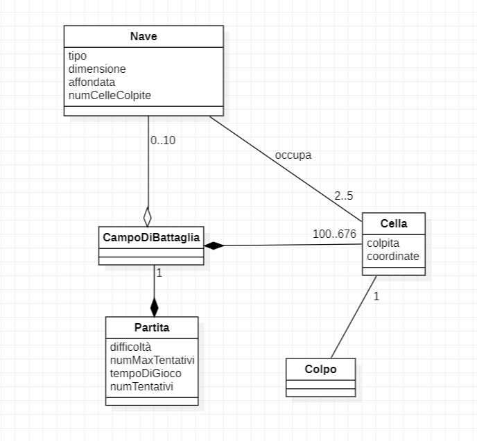
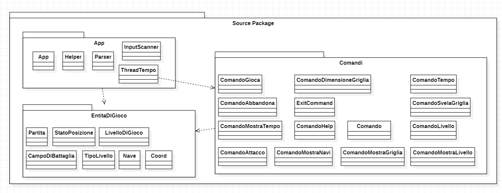
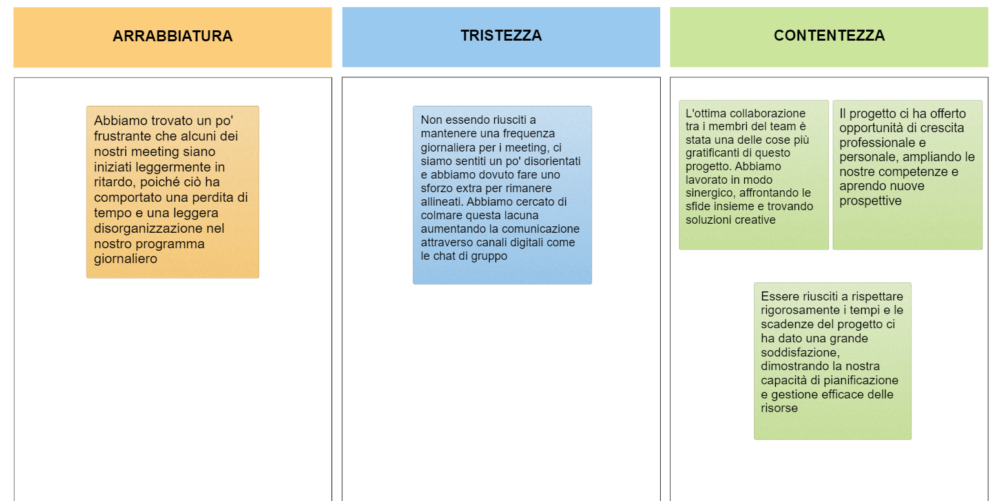

# Report
## Indice
1. Introduzione
2. Modello di dominio
3. Requisiti specifici
   1. Requisiti funzionali
     2. Requisiti non funzionali
4. System Design
5. OO Design
6. Riepilogo del test
7. Manuale utente
8. Processo di sviluppo e organizzazione del lavoro
9. Analisi retrospettiva
   1. Sprint 0
   2. Sprint 1  
 
 ---
# 1. Introduzione
 Il progetto riguarda la realizzazione di un noto gioco di strategia: la battaglia navale, il cui obbiettivo è quello di affondare, nel numero di tentativi disponibili, le varie tipologie di navi esistenti sul campo generato automaticamente dal computer.
 
 L'utente ha a disposizione diversi comandi, i quali possono essere visualizzati tramite il comando `/help`, essi permettono di:
 
- Impostare la difficoltà di gioco ( facile, medio, difficile )
- Mostrare il livello di gioco e il numero massimo di tentativi disponibili
- Mostrare le differenti navi e il numero di esemplari da affondare
- Avviare una nuova partita
- Svelare la griglia con le navi posizionate
- Uscire dal gioco previa conferma

---

 
 

# 2. Modello di dominio

# 3. Requisiti specifici
## 3.1 Requisiti specifici
Requisito funzionale 1 : *Visualizzazione Help*

Come giocatore voglio mostrare l'help con elenco comandi, digitando il comando:
> `/help` o invocando l'app con flag `--h` o `-h`

Il programma risponde con: 

Una descrizione concisa, che normalmente appare all'avvio del programma seguita dalla lista dei comandi dispomibili, uno per riga, come da esempio:
 
- Gioca

- Esci

- ...
#
Requisito funzionale 2 : *Chiusura gioco*

Come giocatore voglio chiudere il gioco, digitando il comando:

>`/esci`

L'app chiede conferma:

- Se la conferma è positiva, l'applicazione si chiude restituendo il controllo al sistema operativo
- Se la conferma è negativa, l'applicazione si predispone a ricevere nuovi tentativi o comandi
#
Requisito funzionale 3: *Livello di gioco*

Come giocatore voglio impostare il livello di gioco per variare il numero massimo di tentativi sbagliati, digitando i comandi:

>`/facile` 
- L'app risponde con OK e imposta a 50 il numero massimo di tentativi falliti

>`/medio`

- L'app risponde con OK e imposta a 30 il numero massimo di tentativi falliti

>`/difficile` 

- L'app risponde con OK e imposta a 10 il mumero massimo di tentativi falliti
#
Requisito funzionale 4 : *Visualizzazione livello di gioco e numero tentativi*

Come giocatore voglio mostrare il livello di gioco e il numero massimo di tentativi falliti, digitando il comadndo :

>`/mostralivello`

L'app risponde visualizzando il livello di gioco e il numero massimo di tentativi falliti
#
Requisito funzionale 5 : *Visualizzazione navi e numero relativo*

Come giocatore voglio mostrare i tipi di nave e il numero, digitando il comando :

>`/mostranavi`

L'app risponde visualizzando, per ogni tipo di nave, la dimensione in quadrati e il numero di esemplari da affondare:

- Cacciatorpediniere &emsp;&ensp;⊠⊠&emsp; *Esemplari : 4*

- Incrociatore &emsp; &emsp; &emsp;⊠⊠⊠&emsp; *Esemplari : 3*

- Corazzata &emsp;&emsp; &emsp; ⊠⊠⊠⊠&emsp; *Esemplari : 2*       

- Portarei &emsp;&emsp; &emsp; ⊠⊠⊠⊠⊠&emsp; *Esemplari : 1*
#
Requisito funzionale 6 : *Iniziare una nuova partita*

Come giocatore voglio iniziare una nuova partita, digitando il comando : 

>`/gioca`

Se nessuna partita è in corso l'applicazione imposta casualmente le navi, in orizzontale o in verticale, mostra la griglia vuota e si predispone a ricevere il primo tentativo o altri comandi.
#
Requisito funzionale 7 : *Svelare griglia con navi in gioco*

Come giocatore voglio svelare la griglia con le navi posizionate, digitando il comando :

>`/svelagriglia`

L'applicazione risponde visualizzando, una griglia 10x10, con le righe numerate da 1 a 10 e le colonne numerate da A a J, e tutte le navi posizionate
#
Requisito funzionale 8 : *Impostare tentativi falliti per livello di gioco*

Come giocatore voglio impostare il numero massimo di tentativi falliti per livello di gioco, digitando i comandi :

>`/facile numero`

L'applicazione risponde con Ok e imposta a *numero* il numero massimo di tentativi falliti

>`/medio numero`

L'applicazione risponde con Ok e imposta a *numero* il numero massimo di tentativi falliti

>`/difficile  numero`

L'applicazione risponde con Ok e imposta a *numero* il numero massimo di tentativi falliti
#
Requisito funzionale 9 : *Impostare il numero massimo di tentativi che si possono fallire*

Come giocatore voglio impostare direttamente il numero massimo di tentativi che si possono fallire, digitando il comando:

>`/tentativi numero `

L'applicazione risponde con Ok e imposta a *numero* il numero massimo di tentativi falliti
#
Requisito funzionale 10 : *Impostare taglia griglia*

Come giocatore voglio impostare la taglia della griglia, digitando i comandi :

>`/standard `

L'applicazione risponde con Ok e imposta a 10x10 la dimensione della griglia (default)

>`/large `

L'applicazione risponde con Ok e imposta a 18x18 la dimensione della griglia

>`/extralarge`

L'applicazione risponde con Ok e imposta a 26x26 la dimensione della griglia
#
Requisito funzionale 11 : *Impostare tempo di gioco*

Come giocatore voglio impostare il tempo di gioco, digitando il comando:

>`/tempo`

L'app risponde con Ok e imposta a *numero* il numero di minuti a disposizione per giocare
#
Requisito funzionale 12 : *Mostrare tempo di gioco*

Come giocatore voglio mostrare il tempo di gioco, digitando il comando:

>`/mostratempo`

L'app risponde visualizzando il numero di minuti trascorsi nel gioco e il numero di minuti ancora disponibili 
#
Requisito funzionale 13 : *Tentativo per colpire la nave*

Come giocatore voglio effettuare un tentativo per colpire una nave, digitando una coppia di caratteri separati da un trattino, corrispondenti rispettivamente al numero di riga e alla lettera della colonna, (es B-4), l'app risponde: 

* "*Acqua*" se sulla cella non è posizionata nessuna nave

* "*Colpito*" se sulla cella è posizionata una nave

* "*Colpito e affondato*" se sulla cella è posizionata una nave ed è l'ultima cella non colpita

 

Qualunque sia l'esito del tentativo, l'applicazione mostra la griglia con le navi colpite parzialmente o affondate, il numero di tentativi già effettuati, e il tempo trascorso.

La partita termina con successo se il tentativo ha affondato l'ultima nave.

La partita termina con insuccesso se è stato raggiunto il numero massimo di tentativi falliti o se è scaduto il tempo di gioco.

 

#
Requisito funzionale 14: *Mostrare griglia con navi colpite e affondate*

Come giocatore voglio mostrare la griglia con le navi colpite e affondate, digitando il comando :

>`/mostragriglia`

L'app risponde visualizzando, una griglia con le righe numerate a partire da 1 e le colonne numerate a partire da A, con le navi affodnare e le sole parti già colpite dalle navi non affondate
#
Requisito funzionale 15 : *Mostrare tentativi effettuati e falltii*

Come giocatore voglio mostrare il numero di tentativi già efettuati e il numero di tentativi falliti, digitando il comando :

>`/mostratentativi`

L'app risponde visualizzando il numero di tentativi già effettuati, il numero di tentativi falliti e il numero massimo di tentativi falliti
#
Requisito funionale 16 : *Abbandonare partita*

Come giocatore voglio abbandonare la partita, digitando il comando:

>`/abbandona`

L'app chiede conferma :

* Se la conferma è *positiva* , l'applicazione risponde visualizzando sulla griglia la posizione di tutte le navi e si predispone a ricevere nuovi comandi

* Se la conferma è *negativa* , l'applicazione si predispone a ricevere nuovi tentativi o comandi

 

---

 
 

## 3.2 Requisiti non funzionali 
---

 

Requisito non funzionale 1 :

Il container docker dell’app deve essere eseguito da terminali che supportano Unicode con encoding UTF-8 o UTF-16.
Elenco di terminali supportati:

Linux:

- terminal
	
Windows:

- Powershell

- Git Bash (in questo caso il comando Docker ha come prefisso winpty; es: winpty docker -it ....)
	
**Comando per l’esecuzione del container**
Dopo aver eseguito il comando docker pull copiandolo da GitHub Packages, Il comando Docker da usare per eseguire il container contenente l’applicazione è:

> docker run --rm -it ghcr.io/softeng2223-inf-uniba/battleship-dongarra2223:latest

---

 
 

# 4. System Design

## Diagramma dei package

 
 

## Diagramma dei componenti 
 
  

Volutamente è stato scelto di non includere in questa relazione tecnica un diagramma dei componenti, poichè la battaglia navale rappresenta un sistema troppo poco complesso per richiederne uno.

---

 
 

# 5. OO Design

 

## Diagrammi di sequenza per le user story più importanti
 
  

Di seguito sono riportate le immagini dei diagrammi di sequenza per le user story considerate più importanti.

 

**1)Come giocatore voglio effettuare un tentativo per colpire una nave**
 

 
 

**2)Come giocatore voglio abbandonare una partita**
 

**3)Come giocatore voglio iniziare una nuova partita**
 

 
 

 
 

 
 

## Diagramma delle classi

 

Di seguito è riportato il diagrammma delle classi :

 

.drawio%20(3).png)

 
 

## Applicazione dei principi di OO Design

 

Per la realizzazione della battaglia navale si è fatto largo uso dei principi fondamentali dell' OO Design. Osserviamo la loro applicazione all'interno del gioco :

- Il principio di **information hiding** è sicuramente quello che di più di tutti si nota, dato l'utilizzo di un linguaggio ad oggetti come java.

- Ogni singola classe si occupa di svolgere compiti specifici che solo lei può effettuare. Cioè, ogni classe ha un' **alta coesione** e quindi una ben definita responsabilità. Ad esempio, ogni singolo comando lanciabile dall'utente è gestito da una singola classe. 

- Grazie all'alta coesione e all'information hiding dato dalla programmazione ad oggetti, (che permette di tenere incapsulata nella classe, e solo in essa, tutto ciò che è di pertinenza dell'entità che la classe modella), i vari componenti presentano un basso **livello di accoppiamento**, cioè sono poco sensibili ai cambiamenti, visto che tutto ciò che li riguarda si trova solo nella classe che li modella. 
- Quest ultima osservazione è sostenuta anche dal fatto che la logica iniettata si trova solo in determinati punti del codice e non è ripetuta in diverse parti di codice **(DRY, Don't repeat yourself).**

- I componenti la cui responsabilità era quella di interagire con l'utente (prendere in input e restituire in output) che è l'unico sistema esterno presente nel gioco, sono ben separati dal resto delle componenti. Difatti le classi adibite a questo sono separate dalle altre e indipendenti dal gioco stesso. In altre parole, **la parte di codice relativa alla presentazione è tenuta separata dal resto dell’applicazione.**

---

 
 

# 7. Manuale utente

## All'avvio

All'apertura, il gioco si interfaccia con l'utente chiedendogli di visualizzare la lista dei comandi inserendo il comando
>`/help`

 

**Output comando `/help`**

---

 
 

## Impostare livello di difficoltà

Il gioco permette all'utente di impostare la difficoltà attraverso tre comandi : 
>`/facile`

>`/medio`

>`/difficile`

 

Più il livello di difficoltà aumenta, più diminuiscono i tentativi in cui l'utente può sbagliare, cioè quei tentativi in cui l'utente non colpisce nessuna nave. Raggiunto il limite massimo di tentativi errati, la partita terminerà con una conseguente sconfitta dell'utente :

- A livello facile l'utente ha a disposizione 50 tentativi falliti al massimo
- A livello medio l'utente ha a disposizione 30 tentativi falliti al massimo
- A livello difficile l'utente ha a disposizione 10 tentativi falliti al massimo

 

**Output comando `/facile`**

 

**Output comando `/medio`**

 

**Output comando `/difficile`**

 

Di default, il livello di difficoltà iniziale è impostato a "facile".

---

 
 

## Visualizzare livello di difficoltà corrente
All'utente è permessa la visualizzazione del livello di difficoltà corrente attraverso il comando 

>`/mostralivello`

 

**Output comando `/mostralivello`**

---

 
 

## Impostare i tentativi a disposizione per livello di difficoltà

All'utente è concessa la possibilità di impostare i tentativi a disposizione per il livello considerato. Ad esempio, l'utente potrebbe decidere di aumentare o diminuire i tentativi a disposizione nel livello facile. Ragionamento analogo per i livello medio e difficile. Ipotizziamo di voler impostare 45 tentativi per il livello facile, 32 per il livello medio e 8 per il livello difficile. I comandi che realizzano questa funzionalità sono :

 

>`/facile 45`

**Output comando `/facile 45`**

 
 

>`/medio 32`

**Output comando `/medio 32`**

 
 

>`/difficile 8`

**Output comando `/difficile 8`**

---

 
 

 ## Impostare arbitrariamente il numero massimo di tentativi failliti

 All'utente è concessa la possibilità di impostare un numero arbitrario di tentativi falliti massimi, a prescindere dal livello di gioco. Ipotizzando di volere impostare un numero di tentativi falliti massimi pari a 40, si utilizza il comando

  

 >`tentativi 40`

 **Output comando `/tentativi 40`**

---

 
 

## Mostrare il numero di tentativi effettuati, il numero di tentativi falliti e il numero di tentativi falliti a disposizione

All'utente è concessa la possibilità di visualizzare il numero di tentativi gia' effettuati, il numero di tentativi falliti e il numero massimo di tentantivi falliti. Basta lanciare il comando 

  

 >`/mostratentativi`

 **Output comando `/mostratentativi`**

 

Nel caso in cui si provi a lanciare questo comando prima di aver avviato una partita il gioco risponderà in questo modo :

---

 
 

## Visualizzare tipo e numero di navi

All'utente è concessa la possibilità di visualizzare i tipi di navi presenti nel gioco. Inoltre per ogni tipo di nave l'utente conosce quante di esse saranno posizionate nel campo di battaglia. Tutto questo viene visualizzato attraverso il comando 

>`/mostranavi`

 

**Output comando `/mostranavi`**

Nel gioco sarano presenti :

- 4 esemplari di Cacciatorpediniere, la cui dimensione è 2
- 3 esemplari di Incrociatore, la cui dimensione è 3
- 2 esemplari di Corazzata, la cui dimensione è 4
- 1 esemplari di Portaerei, la cui dimensione è 5

---

 
 

## Avviare una nuova partita

Per avviare una nuova partita, l'utente deve lanciare il comando

>`/gioca`

 

**Output comando `/gioca`**

 

All'utente viene mostrato il campo di battaglia prima del suo popolamento attraverso le navi ed il numero di tentativi a disposizione per vincere la partita. Una volta lanciato il comando, il campo di battaglia viene popolato in modo casuale. Il numero di navi posizionate, per ogni tipo , rispetta quello citato alla voce **Visualizzazione tipo e numero di navi** di questa guida.
Si ricordi che una volta avviata la partita non sarà più possibile modificare il livello di difficoltà impostato precedentemente. Nel caso si provasse a cambiare livello di difficoltà durante una partita avviata, si avrà il seguente messaggio a schermo : 

 

Una volta avviata la partita l'utente volendo può iniziare a giocare alla battagli navale, cioè iniziare ad affondare le navi. Per giocare alla battaglia navale rimandiamo alla voce **Effettuare un tentativo per colpire una nave** di questa guida.

---

 
 

## Visualizzare campo di battaglia

 

All'utente è permesso poter visualizzare il campo di battaglia  con le navi posizionate durante una partita lanciando il comando

>`/svelagriglia`

 

**Output comando `/svelagriglia`**

 

Questo comando è utilizzabile solo se si è già avviata una partita. Per ulteriori informazioni su come avviare una nuova partita rimandiamo alla voce 
**Avvio di una nuova partita** di questa guida. In caso si provi a lanciare questa comando prima dell'avvio di un nuova partita, il gioco risponde in questo modo :

---

 
 

## Mostrare navi colpite e affondate

All'utente è concessa la possibilità di visualizzare una griglia con le navi affondate e le sole parti gia' colpite delle navi non ancora affondate. Si utilizza il comando 

>`/mostragriglia`

 

**Output comando `/mostragriglia`**

 

Se si prova a lanciare questo comando quando non è ancora stata avviata nessuna partita il gioco risponde con il seguente output :

---

 
 

## Impostare la grandezza del campo da gioco
All'utente è permesso cambiare la dimensione del campo da gioco secondo secondo 3 formati diversi:

- Standard    (dimensione di default, 10x10)
- Large       (dimensione 18x18)
- Extralarge  (dimensione 26x26)

 

I comandi da utilizzare sono rispettivamente :

>`/standard`

**Output comando `/standard`**

 

>`/large`

**Output comando `/large`**

 

>`/extralarge`

**Output comando `/extralarge`**

---

 
 

## Abbandonare una partita in corso
All'utente è concessa la possibilità di poter abbandonare una partita inziata senza uscire dal gioco. Basta lanciare il comando
 
  

>`/abbandona`

**Output comando `/abbandona`**

 

Una volta lanciato il comando, viene restituito il campo di bttaglia con le navi posizionate nella partita appena abbandonata. Il gioco adesso è pronto ad accettare nuovi comandi e, volendo , ad iniziare una nuova partita. Per ulteriori informazioni su come avviare una nuova partita rimandiamo alla voce  **Avvio di una nuova partita** di questa guida. 

 

Se si prova a lanciare questo comando quando non è in corso nessuna partita il gioco fornisce il seguente output :

---

 
 

## Effettuare un tentativo per colpire una nave

Questa funzionalità rappresenta il cuore della battaglia navale poichè all'utente è permesso di effettuare un tentativo per colpire una nave. Basta fornire delle coordinate al gioco. Il sistema di coordinte del gioco è gestito in questo modo:

- le colonne del campo da gioco sono enumerate con le lettere che vanno dalla A alla J (nel caso in cui il campo da gioco sia 10x10) o dalla A alla R (nel caso in cui il campo da gioco sia 18x18) o dalla A alla Z (nel caso in cui il campo da gioco sia 26x26)
 
- le righe del campo da gioco sono numerate con i numeri che vanno da 1 a 10 (nel caso in cui il campo da gioco sia 10x10) o da 1 a 18 (nel caso in cui il campo da gioco sia 18x18) o da 1 a 26 (nel caso in cui il campo da gioco sia 26x26)

 

L'utente fornisce le coordinate separate dal simbolo **-** (ad esempio A-3) ed il gioco risponde con 

- **Acqua** se non si è colpita nessuna nave
- **Colpita** se si è colpita una nave
- **Colpita e affondata** se si è affondata una nave
- **Hai affondato tutte le navi, hai vinto! Digita /gioca per comiciarne un'altra** se si è riusciti a vincere la battaglia navale

 

**Output tentativo utente**

;

 

Ad ogni tentativo vengono mostrati il numero dei tentativi rimasti e una griglia con le celle in cui l'utente è riuscito a colpire una nave ed il colore della nave colpita. Ogni volta che l'utente effettua un tentativo in cui nessuna nave viene colpita viene decrementato il numero dei tentativi a disposizione.

 

Se il numero di tentativi dell'utente è pari a 0 la partita termina con una sconfitta e viene mostrata la griglia con le navi posizionate nella partita appena persa. L'output è il seguente :

---

 
 

## Impostare il tempo di gioco

All'utente è concessa la possibilità di impostare il tempo di gioco, in termini di minuti di gioco. Ipotizzando di volere impostare ad un minuto il tempo di gioco, il comando da utilizzare è 

 

>`/tempo 1`

**Output comando `/tempo 1`**

 

Il timer parte dal momento in cui si avvia una nuova partita. Per ulteriori informazioni su come avviare una nuova partita rimandiamo alla voce  **Avvio di una nuova partita** di questa guida.

 

Se il tempo di gioca scade prima di riuscire a vincere la partita, essa termina automaticamente con una sconfitta. L'output è il seguente :

---

 
 

## Mostrare il tempo di gioco ed i minuti trascorsi

All'utente è concessa la possibilità di mostrare i minuti di gioco impostati e di visualizzare quelli trascorsi attraverso il comando

 

>`/mostratempo`

**Output comando `/mostratempo`**

---

 
 

## Uscire dal gioco

All'utente è permesso uscire dal gioco in qualisiasi momento, anche mentre è in corso una partita.  Per ulteriori informazioni su come avviare una nuova partita rimandiamo alla voce **Avvio di una nuova partita** di questa guida.
 

Basta lanciare il comando

>`/esci`

 

**Output comando `/esci`**

 

Se la risposta dell'utente è si, si esce dal gioco come richiesto, altrimenti il gioco rimane aperto normalmente.

---
 
 

## 8. Processo di sviluppo e organizzazione del lavoro
#
Il team si è coordinato utilizzando principalmente le piattaforme di comunicazione: WhatsApp e Discord.

							

Il gruppo Whatsapp è stato utilizzato per comunicazioni più veloci ed informali, mentre sulla piattaforma Discord abbiamo utilizzato tre canali di comunicazione: 
- Pianificazione issue
- Assistenza
- Analisi retrospettiva
  
Nel canale di comunicazione "pianificazione issue" abbiamo discusso sulla pianificazione e suddivisione degli issue con date di scadenza annesse, il canale "assistenza" è stato utilizzato da ognuno di noi per supportare uno o più dei nostri compagni nella risoluzione degli issue, mentre il canale "analisi retrospettiva" è stato utilizzato per analizzare il nostro stato d'animo e il modo in cui si è lavorato nello Sprint concluso.
Il team durante lo svolgimento delle consegne ha perseguito una strategia precisa nell’organizzazione e nella suddivisione del lavoro.

Prima di mettersi all'opera per la realizzazione dei requisiti funzionali è stato sempre effettuato un primo incontro di chiarifica, seguitosi immediatamente dopo il lancio di ognuno dei 3 sprint, con tutti i membri del team. 

In questo incontro sono stati analizzati i seguenti temi:
- Identificazione e chiarimento dei requisiti funzionali richiesti.
- Identificazione dell'ordine di priorità dei requisiti funzionali da implementare.
- Assegnazione dei vari compiti da svolgere ai membri del team.

Ogni requisito funzionale è stato assegnato ad uno o più membri del team in base alla effettiva difficoltà di realizzazione con annessa data di scadenza.

Durante il primo incontro di chiarifica sono stati enunciati i requisiti richiesti che il programma doveva rispettare. Ogni requisito è stato poi successivamente analizzato e chiarito in maniera più esaustiva, nel caso in cui erano presenti punti poco chiari o dubbi da parte dei membri del team.

Dopo l’incontro iniziale il team si è solitamente riunito ogni due giorni per discutere delle modifiche apportate e/o delle difficoltà incontrate durante lo sviluppo del progetto.

Per ognuno dei 3 sprint è stato creato un milestone, chiamato con il nome del relativo sprint, a cui sono stati assegnati tutti gli issue, le pull request e la project board associati allo sprint in corso.

La project board di ogni sprint prevedeva le seguenti colonne:

- ToDo, relativa agli incarichi assegnati, ma il cui lavoro non è ancora iniziato.
- inProgress, per i compiti in fase di realizzazione.
- Review, per i lavori terminati, ma in attesa di revisione prima del merge.
- Ready, per gli incarichi revisionati dai membri del team, di cui è stato effettuato il merge.
- Done, relativa alle modifiche revisionate dal product owner.

Infine, un paio di giorni prima della data di consegna del progetto, per ogni sprint, il team si è riunito in un incontro finale per un’ultima revisione prima di confermare al product owner la conclusione dello sprint.

## 9. Analisi retrospettiva
##    Sprint 0

 
 

##    Sprint 1

