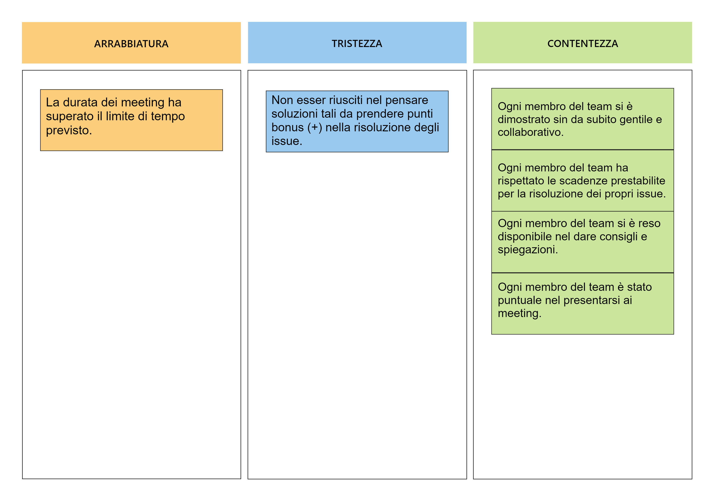

# Report
## Indice
1. Introduzione
2. Modello di dominio
3. Requisiti specifici
   1. Requisiti funzionali
     2. Requisiti non funzionali
4. System Design
5. OO Design
6. Riepilogo del test
7. Manuale utente
8. Processo di sviluppo e organizzazione del lavoro
9. Analisi retrospettiva
   1. Sprint 1   
 
 ---
## 1. Introduzione
 Il progetto riguarda la realizzazione di un noto gioco di strategia: la battaglia navale, il cui obbiettivo è quello di affondare, nel numero di tentativi disponibili, le varie tipologie di navi esistenti sul campo generato automaticamente dal computer.
 
 L'utente ha a disposizione diversi comandi, i quali possono essere visualizzati tramite il comando `/help`, essi permettono di:
 
- Impostare la difficoltà di gioco ( facile, medio, difficile )
- Mostrare il livello di gioco e il numero massimo di tentativi disponibili
- Mostrare le differenti navi e il numero di esemplari da affondare
- Avviare una nuova partita
- Svelare la griglia con le navi posizionate
- Uscire dal gioco previa conferma

## 9. Analisi retrospettiva
##    Sprint 0

# 3. Requisiti specifici
## 3.1 Requisiti specifici
Requisito funzionale 1 : *Visualizzazione Help*

Come giocatore voglio mostrare l'help con elenco comandi, digitando il comando:
> `/help` o invocando l'app con flag `--h` o `-h`

Il programma risponde con: 

Una descrizione concisa, che normalmente appare all'avvio del programma seguita dalla lista dei comandi dispomibili, uno per riga, come da esempio:
 
- Gioca

- Esci

- ...
#
Requisito funzionale 2 : *Chiusura gioco*

Come giocatore voglio chiudere il gioco, digitando il comando:

>`/esci`

L'app chiede conferma:

- Se la conferma è positiva, l'applicazione si chiude restituendo il controllo al sistema operativo
- Se la conferma è negativa, l'applicazione si predispone a ricevere nuovi tentativi o comandi
#
Requisito funzionale 3: *Livello di gioco*

Come giocatore voglio impostare il livello di gioco per variare il numero massimo di tentativi sbagliati, digitando i comandi:

>`/facile` 
- L'app risponde con OK e imposta a 50 il numero massimo di tentativi falliti

>`/medio`

- L'app risponde con OK e imposta a 30 il numero massimo di tentativi falliti

>`/difficile` 

- L'app risponde con OK e imposta a 10 il mumero massimo di tentativi falliti
#
Requisito funzionale 4 : *Visualizzazione livello di gioco e numero tentativi*

Come giocatore voglio mostrare il livello di gioco e il numero massimo di tentativi falliti, digitando il comadndo :

>`/mostralivello`

L'app risponde visualizzando il livello di gioco e il numero massimo di tentativi falliti
#
Requisito funzionale 5 : *Visualizzazione navi e numero relativo*

Come giocatore voglio mostrare i tipi di nave e il numero, digitando il comando :

>`/mostranavi`

L'app risponde visualizzando, per ogni tipo di nave, la dimensione in quadrati e il numero di esemplari da affondare:

- Cacciatorpediniere &emsp;&ensp;⊠⊠&emsp; *Esemplari : 4*

- Incrociatore &emsp; &emsp; &emsp;⊠⊠⊠&emsp; *Esemplari : 3*

- Corazzata &emsp;&emsp; &emsp; ⊠⊠⊠⊠&emsp; *Esemplari : 2*       

- Portarei &emsp;&emsp; &emsp; ⊠⊠⊠⊠⊠&emsp; *Esemplari : 1*
#
Requisito funzionale 6 : *Iniziare una nuova partita*

Come giocatore voglio iniziare una nuova partita, digitando il comando : 

>`/gioca`

Se nessuna partita è in corso l'applicazione imposta casualmente le navi, in orizzontale o in verticale, mostra la griglia vuota e si predispone a ricevere il primo tentativo o altri comandi.
#
Requisito funzionale 7 : *Svelare griglia con navi in gioco*

Come giocatore voglio svelare la griglia con le navi posizionate, digitando il comando :

>`/svelagriglia`

L'applicazione risponde visualizzando, una griglia 10x10, con le righe numerate da 1 a 10 e le colonne numerate da A a J, e tutte le navi posizionate

## 3.2 Requisiti non funzionali 
Requisito non funzionale 1 :

Il container docker dell’app deve essere eseguito da terminali che supportano Unicode con encoding UTF-8 o UTF-16.
Elenco di terminali supportati:

Linux:

- terminal
	
Windows:

- Powershell

- Git Bash (in questo caso il comando Docker ha come prefisso winpty; es: winpty docker -it ....)
	
**Comando per l’esecuzione del container**
Dopo aver eseguito il comando docker pull copiandolo da GitHub Packages, Il comando Docker da usare per eseguire il container contenente l’applicazione è:

> docker run --rm -it ghcr.io/softeng2223-inf-uniba/battleship-dongarra2223:latest

